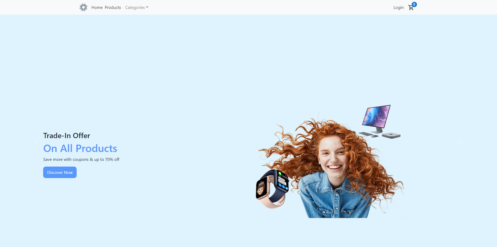

##Getting Started with Create React App
# App Techniques 
- React
- react-router-dom
- redux , react-redux
- redux-persist
- react-toastify
- react-timeago
- yup
- axios
- bootstrap , react-bootstrap
- react-stripe-checkout

## To Run The Project
- npm start
- To Run Project npm start 

#Be care the application has secret keys u should have some of this keys
- application already fetch data from api u can put it in .env environment file 
--> REACT_APP_API='https://online-shopping-manage.herokuapp.com/api/'
- public key from stripe test mode to test pay method !not important u can run without
#if you want Quick Start you can visit this sites
-Front-End : https://osh-app-e-commerce.000webhostapp.com/
-Back-End : https://online-shopping-manage.herokuapp.com/
